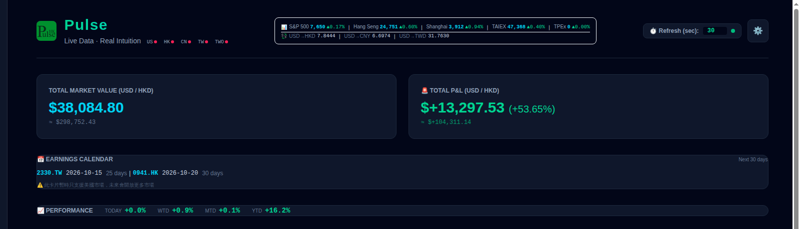
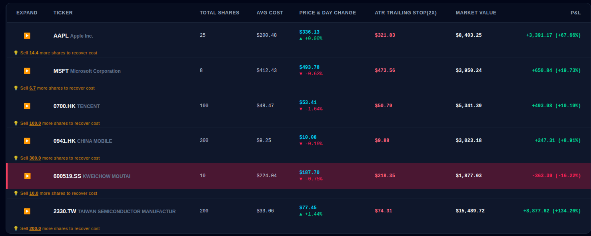
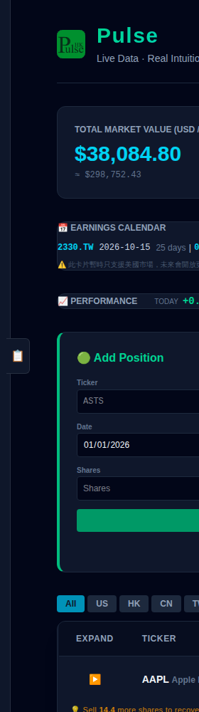
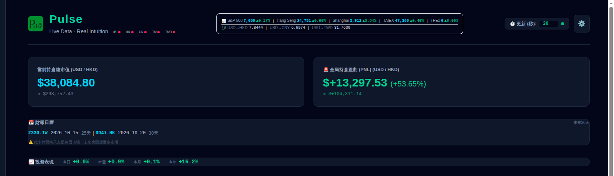

# Pulse

**Live Data · Real Intuition**

A lightweight, **self-hosted** portfolio dashboard for the **US, Hong Kong, Mainland China and Taiwan** markets — live prices, P&L, watchlist, market indices, FX rates, earnings dates and risk metrics, from a single Python service you run yourself.

No account. No cloud. No broker credentials. Your holdings live in a JSON file on your own machine.




**Live demo** (the hosted build, sample data, nothing to install): <https://pulsehk.net/demo>

## Quick start

### Docker (recommended)

```bash
docker compose up -d          # → http://localhost:5000
```

Or without compose:

```bash
docker build -t pulse .
docker run -d --name pulse -p 5000:5000 -v pulse-data:/data pulse
```

Your data lives in the `pulse-data` volume, so rebuilding the image never touches it.

### Python

```bash
git clone https://github.com/livedatarealintuition/pulse.git
cd pulse
python3 -m venv venv && source venv/bin/activate
pip install -r requirements.txt
python pulse_free.py          # → http://localhost:5000
```

Python 3.9+ (the app uses `zoneinfo`). Runs on Linux, macOS and Windows, and is happy on a Raspberry Pi / ARM SBC.

## Screenshots

| Holdings and P&L | Watchlist sidebar |
|:---:|:---:|
|  |  |

| Traditional Chinese UI |  |
|:---:|:---:|
|  |  |

The complete dashboard is in [`screenshots/04-dashboard-full.png`](screenshots/04-dashboard-full.png). Screenshots use sample data, not real holdings.

## Features

### Markets and prices
- **US / HK / CN (SS & SZ) / TW / TWO** tickers in one portfolio
- Automatic padding and suffixes: `700` + HK → `0700.HK`, `2330` + TW → `2330.TW`, `600519` + CN → `600519.SS`
- Batch quotes via yfinance with a TTL cache (30 s while a market is open, 4 h once everything closes)
- Market-status dots and per-market filter tabs (All / US / HK / CN / TW / TWO)
- Prices shown in your primary currency, whatever market they trade in

### Portfolio
- BUY / SELL history per ticker, commissions included
- Average cost, market value, unrealised P&L and ROI per position
- Capital-recovery badge once realised profit covers the position cost
- A position sold down to zero becomes CLOSED — the row and its full history stay
- Click any row to expand every BUY/SELL for that ticker

### Watchlist
- Slide-out sidebar with categories and drag-and-drop ordering
- Add tickers with a market selector; the server appends the correct suffix
- Optional target price per ticker, with an alert card when the target is hit
- Add / rename / delete without a page reload (AJAX fragment)

### Analysis cards
- **Performance** — Today / WTD / MTD / YTD from historical closes
- **Indices ticker** — top bar, up to 5 of 13 indices (S&P 500, Hang Seng, Shanghai, TAIEX, TPEx, NASDAQ, Dow, SOX, Nikkei …) plus an FX row
- **Earnings calendar** — upcoming earnings for every ticker you hold (30-day lookahead)
- **ATR-20 trailing stop** column, in your primary currency
- **Pro** (see below): risk metrics, weight %, market distribution, cash ratio, AI audit, custom background

### Multi-currency
- Primary currency: USD / HKD / TWD / CNY / JPY / EUR / GBP
- Optional secondary display currency with its own FX row
- Cross-rate matrix, and buy/sell price labels that follow the ticker's market

### Interface
- English / 繁體中文 / 简体中文 (UI *and* AI report language)
- Dark theme, responsive layout, plus a dedicated `/mobile` view
- Import / export portfolio and watchlist as JSON
- Optional AI audit with DeepSeek, OpenAI, Gemini, or any local OpenAI-compatible server (Ollama / vLLM / LM Studio)

## Free and Pro (self-hosted)

The open-source build in this repository is the **Free** edition: everything above except the items marked Pro. Pro is gated in the source by a single `IS_PRO` constant, so you can read exactly what it adds:

- Risk metrics card — Sharpe, Sortino, volatility, max drawdown, VaR-95; historical / parametric / Monte Carlo methods over 90 days – 5 years
- Weight % column, market distribution card, cash ratio card
- AI audit report with editable prompt (Strict / Balanced / Relaxed plus custom prompt variables)
- Target price alerts and a custom background image

## Data and privacy

- Everything is local: `portfolio.json`, `watchlist.json` and `system_config.json` sit next to the app (or in `$PULSE_HOME`)
- No telemetry, no analytics, no account, no cloud sync
- Outbound requests go only to Yahoo Finance (prices, FX, earnings) and to the AI provider **you** configure
- **There is no login.** Keep it on your LAN, or put it behind a reverse proxy with authentication if you expose it

## Configuration

| Environment variable | Purpose | Default |
|---|---|---|
| `PULSE_HOME` | Directory holding `portfolio.json`, `watchlist.json`, `system_config.json` and `uploads/` | the script's directory |

Settings (⚙️) covers language, refresh interval, currencies, cash balance, indices, risk-metric options, and the AI provider / model / URL / key / timeout. `system_config.example.json` shows the on-disk format.

> Note: when `PULSE_HOME` is set the app also looks for `pulse.css` and `pulse_logo.jpg` in that directory — the container entrypoint copies them there for you.

## Markets supported

| Market | Ticker format | Example |
|---|---|---|
| US | plain | `AAPL`, `MSFT` |
| Hong Kong | `.HK` | `0005.HK`, `0700.HK` |
| Shanghai | `.SS` | `600519.SS` |
| Shenzhen | `.SZ` | `000001.SZ` |
| Taiwan | `.TW` | `2330.TW` |
| Taiwan OTC | `.TWO` | `6488.TWO` |

## Project layout

```
pulse/
├── pulse_free.py              # the whole app (Flask, dashboard template included inline)
├── risk_metrics.py            # risk-metric maths (numpy)
├── pulse.css                  # pre-built Tailwind CSS
├── pulse_logo.jpg
├── Dockerfile, docker-compose.yml, docker-entrypoint.sh
├── requirements.txt
├── check_translations.py      # dev helper: verify i18n keys across languages
├── system_config.example.json
└── screenshots/
```

Runtime files (git-ignored): `portfolio.json`, `watchlist.json`, `system_config.json`, `uploads/`.

### Rebuilding the CSS (optional)

`pulse.css` is pre-built and committed. After changing Tailwind classes:

```bash
curl -sL https://github.com/tailwindlabs/tailwindcss/releases/latest/download/tailwindcss-linux-x64 -o tailwindcss
chmod +x tailwindcss
grep -oP 'class="\K[^"]+' pulse_free.py | tr ' ' '\n' | sort -u > /tmp/classes.txt
python3 -c "print('<div class=\"' + ' '.join(open('/tmp/classes.txt').read().split()) + '\"></div>')" > pulse_classes.html
echo '@import "tailwindcss";' > input.css
./tailwindcss --input input.css --output pulse.css --minify
rm input.css pulse_classes.html
```

## Limitations

- **Manual entry.** There is no broker or bank sync — you add your own trades (JSON import/export is the escape hatch).
- Prices, FX and earnings come from Yahoo Finance; a ticker Yahoo does not serve shows no price.
- Single user by design; no multi-account support.
- Informational only — not investment advice. Quotes can lag the market.

## License

MIT — see [LICENSE](LICENSE).

Pulse is not affiliated with Yahoo Finance. Market data is provided by Yahoo Finance for personal use; check their terms before relying on it for anything else.
